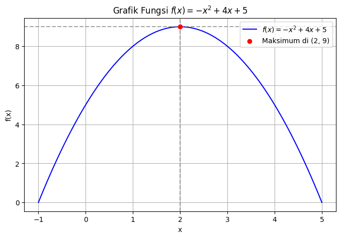
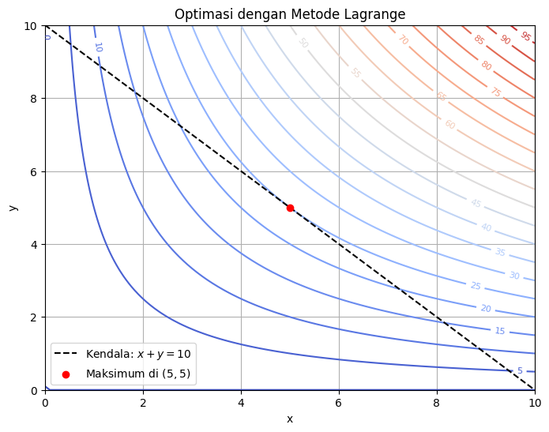
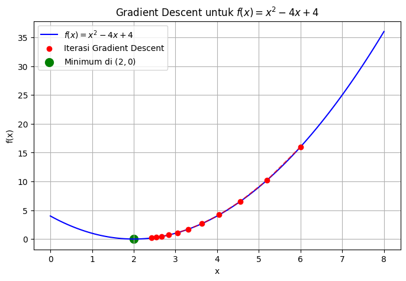
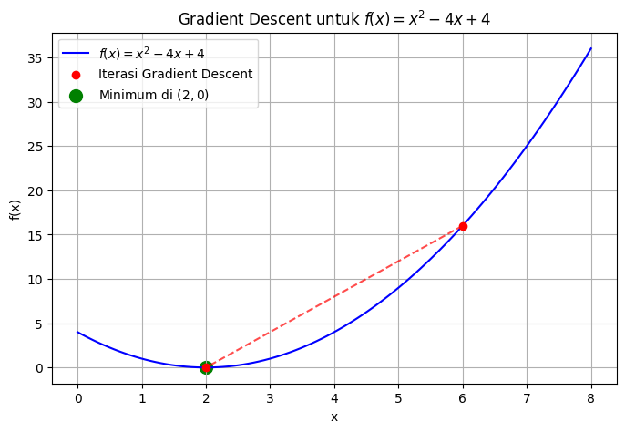

# Optimasi Klasik (Analitik dan Numerik)

📧 agungsetiabudi@ub.ac.id

---
## Optimasi Analitik
- Optimasi klasik secara analitik menggunakan turunan adalah pendekatan matematis untuk menemukan nilai maksimum atau minimum dari suatu fungsi secara eksak.
- Metode ini sangat berguna dalam berbagai bidang, seperti ekonomi, teknik, dan kecerdasan buatan.

---

## **Konsep Dasar**
Misalkan kita memiliki fungsi tujuan $f(x)$ yang ingin kita optimalkan (maksimum atau minimum). Langkah utama dalam optimasi analitik menggunakan turunan adalah:

1. **Menentukan Turunan Pertama ($f'(x)$)**  
   Titik ekstrem terjadi ketika turunan pertama fungsi sama dengan nol:
   $f'(x) = 0$
   Titik-titik ini disebut **titik kritis**.
---
2. **Menentukan Jenis Ekstremum**  
   Setelah mendapatkan titik kritis, kita menganalisisnya dengan menggunakan:
   - **Turunan Kedua ($f''(x)$)**:
     - Jika $f''(x) > 0$ di titik kritis, maka titik tersebut adalah **minimum lokal**.
     - Jika $f''(x) < 0$ di titik kritis, maka titik tersebut adalah **maksimum lokal**.
   - Alternatif lain adalah menggunakan **Uji Derivatif Pertama**, yaitu mengevaluasi tanda dari $f'(x)$ sebelum dan sesudah titik kritis.

---
### **Contoh 1: Memaksimalkan Fungsi Kuadratik**
Hitunglah nilai optimum dari: $f(x) = -x^2 + 4x + 5$
- **Langkah 1: Hitung Turunan Pertama**
   - $f'(x) = -2x + 4$
   - Set $f'(x) = 0$ untuk mencari titik kritis:
   - $-2x + 4 = 0$
   - $x = 2$
---
- **Langkah 2: Gunakan Turunan Kedua untuk Klasifikasi**
   - $f''(x) = -2$
   - Karena $f''(x) < 0$, maka titik $x = 2$ adalah **maksimum lokal**.

- **Langkah 3: Menentukan Nilai Maksimum**
   - Substitusi $x = 2$ ke dalam fungsi:
   - $f(2) = -(2)^2 + 4(2) + 5 = -4 + 8 + 5 = 9$
   - Jadi, **maksimum lokal terjadi di $x = 2$ dengan nilai maksimum $f(2) = 9$**.

---
 

---
### **Optimasi dengan Metode Lagrange**  
- Metode Lagrange digunakan untuk menyelesaikan masalah optimasi dengan **kendala**. 
- Dalam banyak kasus, kita ingin memaksimalkan atau meminimalkan suatu fungsi $f(x, y, \dots)$ dengan kendala berupa persamaan $g(x, y, \dots) = 0$.  

---

## **Konsep Dasar**  
- Diberikan fungsi tujuan:
$f(x, y)$
- dengan kendala:
$g(x, y) = 0$
- kita memperkenalkan **fungsi Lagrange**:
$
\mathcal{L}(x, y, \lambda) = f(x, y) + \lambda g(x, y)
$
- di mana $\lambda$ disebut sebagai **multiplikator Lagrange**.  
---
**Langkah-langkah optimasi dengan Lagrange:**
1. Hitung turunan parsial dari $\mathcal{L}$ terhadap setiap variabel dan set sama dengan nol:
   $
   \frac{\partial \mathcal{L}}{\partial x} = 0, \quad
   \frac{\partial \mathcal{L}}{\partial y} = 0, \quad
   \frac{\partial \mathcal{L}}{\partial \lambda} = 0
   $
2. Selesaikan sistem persamaan untuk $x, y, \lambda$.
3. Tentukan nilai optimal dari $f(x, y)$.

---

**Contoh: Memaksimalkan Fungsi dengan Kendala**  
- Misalkan kita ingin memaksimalkan:
$
f(x, y) = x y
$
- dengan kendala:
$
x + y = 10
$

**Langkah 1: Buat Fungsi Lagrange**  
$
\mathcal{L}(x, y, \lambda) = xy + \lambda (10 - x - y)
$

---
**Langkah 2: Hitung Turunan Parsial**  
- $
\frac{\partial \mathcal{L}}{\partial x} = y - \lambda = 0
$
- $
\frac{\partial \mathcal{L}}{\partial y} = x - \lambda = 0
$
- $
\frac{\partial \mathcal{L}}{\partial \lambda} = 10 - x - y = 0
$

**Langkah 3: Selesaikan Sistem Persamaan**  
- Dari $y - \lambda = 0$ dan $x - \lambda = 0$, kita peroleh:
$
y = \lambda, \quad x = \lambda
$
---
- Substitusi ke kendala:
$
x + y = 10 \Rightarrow \lambda + \lambda = 10 \Rightarrow 2\lambda = 10 \Rightarrow \lambda = 5
$

- Sehingga:
$
x = 5, \quad y = 5
$

**Langkah 4: Hitung Nilai Maksimum**  
- $f(5,5) = 5 \times 5 = 25$

---

---

### **Optimasi Numerik: Gradient Descent**  

- Gradient Descent adalah metode optimasi numerik yang digunakan untuk menemukan minimum suatu fungsi dengan mengupdate parameter secara iteratif berdasarkan gradiennya.
- Metode ini sangat populer dalam **machine learning** dan **deep learning** untuk meminimalkan fungsi loss.

---
### **Konsep Dasar Gradient Descent**  
- Diberikan fungsi yang ingin diminimalkan:  
$f(x)$
- Gradient Descent menggunakan aturan update sebagai berikut:
$x_{t+1} = x_t - \alpha \nabla f(x_t)$
- di mana:
   - $x_t$ adalah nilai parameter pada iterasi ke-$t$,
   - $\alpha$ adalah **learning rate**, yang menentukan seberapa besar langkah perpindahan,
   - $\nabla f(x_t)$ adalah **gradien** dari fungsi terhadap $x$, yang menunjukkan arah perubahan tercepat.
---
### **Variasi Gradient Descent**
1. **Batch Gradient Descent** – Menggunakan seluruh dataset untuk menghitung gradien setiap iterasi.
2. **Stochastic Gradient Descent (SGD)** – Menggunakan satu contoh data secara acak untuk setiap iterasi.
3. **Mini-Batch Gradient Descent** – Kombinasi antara batch dan stochastic, menggunakan subset kecil dari dataset.

---

#### **Contoh dan Penyelesaian**
- Misalkan kita ingin meminimalkan fungsi:  
$f(x) = x^2 - 4x + 4$

- **Langkah 1: Hitung Gradien**  
Gradien dari fungsi ini adalah:
$\nabla f(x) = \frac{d}{dx} (x^2 - 4x + 4) = 2x - 4$

- **Langkah 2: Inisialisasi Parameter**  
Misalkan kita mulai dari $x_0 = 6$ dan memilih **learning rate** $\alpha = 0.1$.

---
- **Langkah 3: Iterasi Update**  
Gunakan rumus Gradient Descent:
$
x_{t+1} = x_t - \alpha (2x_t - 4)
$
Lakukan iterasi hingga nilai $x$ konvergen.

---

---
- Grafik di atas menunjukkan jalur iterasi Gradient Descent menuju titik minimum di $x = 2$.
- Titik awal di $x = 6$ secara bertahap bergerak turun mengikuti gradien hingga mencapai nilai minimum global $(2,0)$.

---
### **Metode Newton**  
- Metode ini menggunakan pendekatan **kuadratik** untuk mempercepat konvergensi dibandingkan dengan Gradient Descent. Aturannya adalah:

- $x_{t+1} = x_t - \frac{f'(x_t)}{f''(x_t)}$

- di mana:
   - $x_t$ adalah nilai pada iterasi ke-$t$,
   - $f'(x_t)$ adalah **turunan pertama** dari fungsi (gradien),
   - $f''(x_t)$ adalah **turunan kedua** dari fungsi (Hessian jika multi-variabel).

Metode ini sangat cepat jika turunan kedua $f''(x)$ tidak nol dan fungsi cukup halus.

---

#### **Contoh dan Penyelesaian**
Misalkan kita ingin menemukan minimum dari:

$f(x) = x^2 - 4x + 4$

**Langkah 1: Hitung Turunan**  
- Turunan pertama:
  $f'(x) = 2x - 4$
- Turunan kedua:
  $f''(x) = 2$
---
**Langkah 2: Gunakan Metode Newton**  
- Gunakan formula:
$
x_{t+1} = x_t - \frac{2x_t - 4}{2}
$

**Langkah 3: Iterasi**  
- Misalkan kita mulai dari $x_0 = 6$, iterasi pertama:
$
x_1 = 6 - \frac{2(6) - 4}{2} = 6 - \frac{12 - 4}{2} = 6 - 4 = 2
$

Karena dalam satu iterasi sudah mencapai minimum, ini menunjukkan **konvergensi sangat cepat**, dibandingkan Gradient Descent yang memerlukan beberapa iterasi.

---

---
- Grafik di atas menunjukkan iterasi metode Newton, yang langsung mencapai minimum di $x = 2$ hanya dalam satu langkah.
- Ini membuktikan bahwa metode Newton memiliki **konvergensi sangat cepat**, terutama untuk fungsi dengan turunan kedua yang tidak berubah (konstan).

---

### **Optimasi dalam Regresi Linear**

- Regresi linear adalah teknik yang digunakan untuk memodelkan hubungan antara variabel independen $X$ dan variabel dependen $y$. Modelnya memiliki bentuk:  

- $y = wX + b$

- di mana:
   - $w$ adalah **koefisien regresi** (slope),
   - $b$ adalah **intercept** (bias),
   - $X$ adalah data input.
---
- Untuk mendapatkan $w$ dan $b$, kita meminimalkan fungsi **Mean Squared Error (MSE)**:  

- $J(w, b) = \frac{1}{m} \sum_{i=1}^{m} (y_i - (w x_i + b))^2$

---

### **Optimasi Parameter: Gradient Descent vs Newton’s Method**  
- Kita akan membahas **dua metode optimasi numerik** untuk menemukan nilai $w$ dan $b$ yang optimal:

- **Gradient Descent**: Melakukan update bertahap berdasarkan gradien fungsi loss.

---

#### **Optimasi dengan Gradient Descent**
- **Turunan Fungsi Loss**
Untuk melakukan optimasi dengan **Gradient Descent**, kita perlu menghitung turunan parsial dari fungsi MSE terhadap $w$ dan $b$:

- $\frac{\partial J}{\partial w} = -2 \sum_{i=1}^{m} x_i (y_i - (w x_i + b))$

- $\frac{\partial J}{\partial b} = -2 \sum_{i=1}^{m} (y_i - (w x_i + b))$
---

#### **Aturan Update**
Update parameter dilakukan dengan:

- $w_{t+1} = w_t - \alpha \frac{\partial J}{\partial w}$

- $b_{t+1} = b_t - \alpha \frac{\partial J}{\partial b}$

- di mana $\alpha$ adalah **learning rate**.
